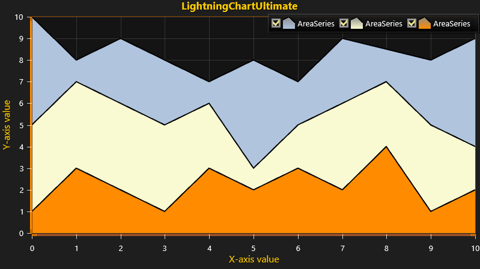

# 2D AreaSeries Chart

This tutorial explains how to create a simple 2D chart with multiple *AreaSeries*.  
*AreaSeries* can be seen as a line connecting all datapoints assigned to it and coloring the area between the line and the axis.

*AreaSeries* can be utilized in many ways from visual comparison of different datas to visualizing trends/patterns overtime.  

The tutorial assumes that you have created a new chart with *LightningChart* on a WinForms or WPF application. If not, please follow our [Simple 2D Chart](https://www.arction.com/tutorials/#/lcu_tutorial_simple2Dchart_01) on creating an application.



##### 1. Create a new AreaSeries and add styling for created series.

You can define colors using *System.Windows.Media.Color* or *System.Drawing.Color* depending on whether you are using WPF or WinForms.

```csharp
// Create a new AreaSeries.
var areaSeries1 = new AreaSeries(chart.ViewXY, axisX, axisY);

// Add styling for created series.
areaSeries1.Fill.Color = Color.FromRgb(176, 196, 222); // LightSteelBlue.
areaSeries1.LineStyle.Color = Color.FromRgb(0, 0, 0); // Black.
areaSeries1.Fill.GradientFill = GradientFill.Solid;
```

##### 2. Define AreaSeriesPoints and add them to AreaSeries.

```csharp
// Define AreaSeriesPoints.
AreaSeriesPoint[] points1 = new AreaSeriesPoint[]{
    new AreaSeriesPoint(0, 10),
    new AreaSeriesPoint(1, 8),
    new AreaSeriesPoint(2, 9),
    new AreaSeriesPoint(3, 8),
    new AreaSeriesPoint(4, 7),
    new AreaSeriesPoint(5, 8),
    new AreaSeriesPoint(6, 7),
    new AreaSeriesPoint(7, 9),
    new AreaSeriesPoint(9, 8),
    new AreaSeriesPoint(10, 9)
};

// Add points to series.
areaSeries1.AddValues(points1);
```

##### 3. Add AreaSeries to chart.

```csharp
// Add AreaSeries to chart.
chart.ViewXY.AreaSeries.Add(areaSeries1);
```

##### 4. Create 2 new AreaSeries and add styling.

```csharp
// Create 2 new AreaSeries.
var areaSeries2 = new AreaSeries(chart.ViewXY, axisX, axisY);
var areaSeries3 = new AreaSeries(chart.ViewXY, axisX, axisY);

// Add styling for created series.
areaSeries2.Fill.Color = Color.FromRgb(250, 250, 210); // LightGoldenrodYellow.
areaSeries2.LineStyle.Color = Color.FromRgb(0, 0, 0); // Black.
areaSeries2.Fill.GradientFill = GradientFill.Solid;

areaSeries3.Fill.Color = Color.FromRgb(255, 140, 0); // DarkOrange.
areaSeries3.LineStyle.Color = Color.FromRgb(0, 0, 0); // Black. 
areaSeries3.Fill.GradientFill = GradientFill.Solid;
```

##### 5. Define AreaSeriesPoints for both new AreaSeries' and add them to AreaSeries.

```csharp
// Define AreaSeriesPoints for both new AreaSeries.
AreaSeriesPoint[] points2 = new AreaSeriesPoint[]{
    new AreaSeriesPoint(0, 5),
    new AreaSeriesPoint(1, 7),
    new AreaSeriesPoint(3, 5),
    new AreaSeriesPoint(4, 6),
    new AreaSeriesPoint(5, 3),
    new AreaSeriesPoint(6, 5),
    new AreaSeriesPoint(7, 6),
    new AreaSeriesPoint(8, 7),
    new AreaSeriesPoint(9, 5),
    new AreaSeriesPoint(10, 4)
};

AreaSeriesPoint[] points3 = new AreaSeriesPoint[]{
    new AreaSeriesPoint(0, 1),
    new AreaSeriesPoint(1, 3),
    new AreaSeriesPoint(3, 1),
    new AreaSeriesPoint(4, 3),
    new AreaSeriesPoint(5, 2),
    new AreaSeriesPoint(6, 3),
    new AreaSeriesPoint(7, 2),
    new AreaSeriesPoint(8, 4),
    new AreaSeriesPoint(9, 1),
    new AreaSeriesPoint(10, 2)
};

// Add points to series.
areaSeries2.AddValues(points2);
areaSeries3.AddValues(points3);
```

##### 6. Add AreaSeries to chart.

```csharp
 // Add AreaSeries to chart.
view.AreaSeries.Add(areaSeries2);
view.AreaSeries.Add(areaSeries3);
```
